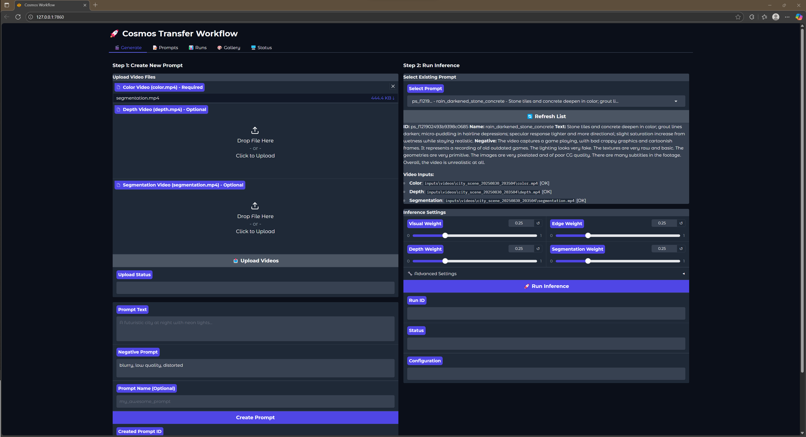
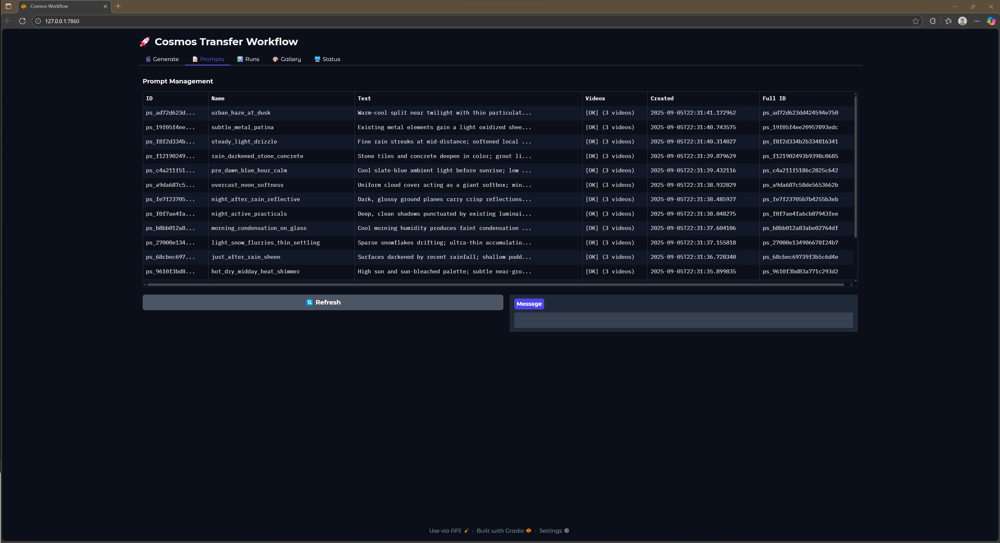
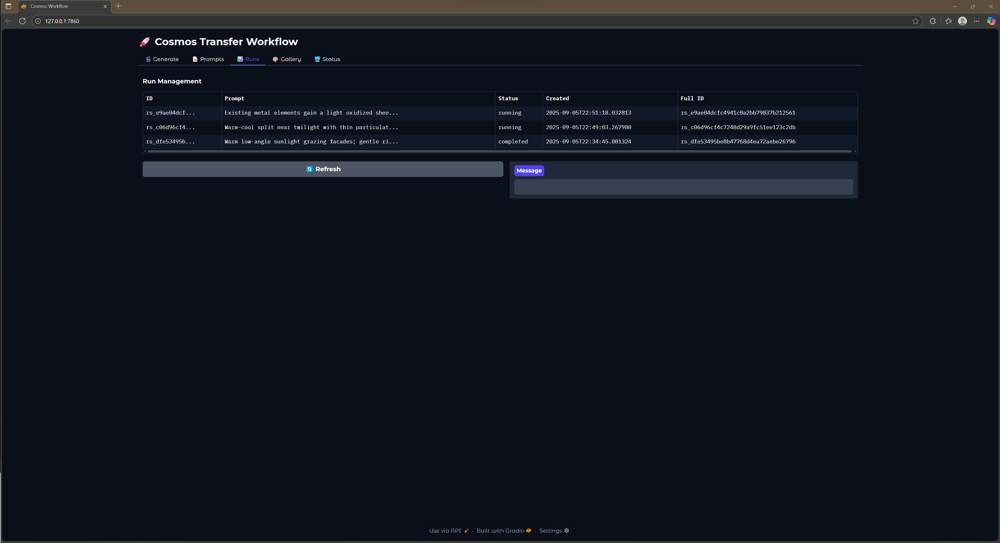
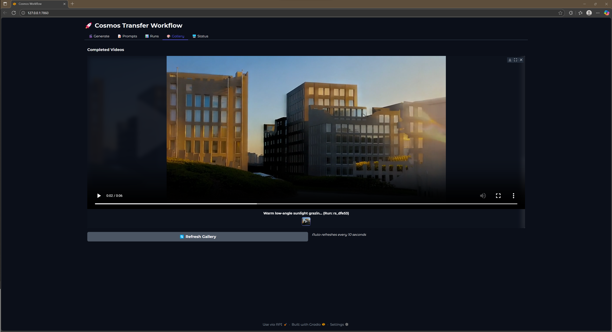
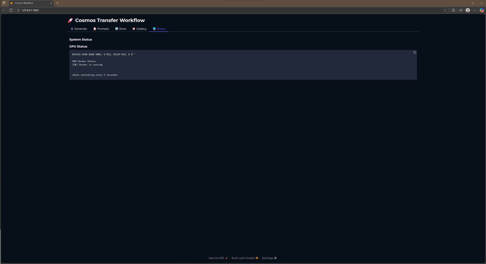

# Cosmos Workflow System

A production-ready Python orchestration system for NVIDIA Cosmos Transfer video generation, featuring remote GPU execution, batch processing, and real-time monitoring.

## 🌐 Web Interface

Launch the Gradio UI for interactive workflow:
```bash
cosmos ui
# Opens browser at http://localhost:7860
```

### UI Features

The Gradio interface provides a comprehensive workflow management system with five main tabs:

#### Generate Tab

- **Two-step workflow**: Create prompts and run inference separately
- **Video upload**: Drag-and-drop support for color and depth video pairs
- **Segmentation upload**: Optional segmentation video for enhanced control
- **Real-time preview**: Uploaded videos displayed inline
- **Inference settings**: Adjustable visual, depth, edge, and segmentation weights
- **Advanced options**: Run ID customization, status monitoring, and configuration presets

#### Prompts Tab

- **Prompt management**: View all created prompts with metadata
- **Search and filter**: Find prompts by text, ID, or creation date
- **Batch operations**: Select multiple prompts for bulk inference
- **Quick actions**: Direct inference launch from the prompt list
- **Details view**: Full prompt information including associated videos and run history

#### Runs Tab

- **Run monitoring**: Track all inference runs with status indicators
- **Live updates**: Auto-refreshing status for running jobs
- **Output access**: Direct download links for completed generations
- **Run details**: View full parameters, timing, and logs for each run

#### Gallery Tab

- **Visual browser**: Preview all generated videos in a grid layout
- **Video player**: Full-screen playback with controls
- **Auto-refresh**: New completions appear automatically
- **Download options**: Save individual or batch download outputs
- **Metadata display**: View prompt text and generation parameters

#### Status Tab

- **GPU monitoring**: Real-time GPU status and availability
- **Container tracking**: View running Docker containers
- **Resource usage**: Monitor GPU memory and utilization
- **Auto-refresh**: Updates every 5 seconds when jobs are running

Features include real-time log streaming, batch management, GPU monitoring, and gallery view for completed generations.

## 🚀 Quick Start

### Prerequisites
- Python 3.10+
- SSH access to GPU instance with NVIDIA Cosmos Transfer
- Docker on remote instance with NVIDIA Container Toolkit

### Remote Instance Setup
The remote GPU instance needs NVIDIA Cosmos Transfer set up according to NVIDIA's instructions:

```bash
# Clone the cosmos-transfer1 source code
git clone git@github.com:nvidia-cosmos/cosmos-transfer1.git
cd cosmos-transfer1
git submodule update --init --recursive
```

Cosmos runs only on Linux systems (tested with Ubuntu 24.04, 22.04, and 20.04) and requires Python 3.12.x. Docker and the NVIDIA Container Toolkit must be installed.

```bash
# Build the Docker image
docker build -f Dockerfile . -t nvcr.io/$USER/cosmos-transfer1:latest

# Generate a Hugging Face access token (set to 'Read' permission)
# Log in to Hugging Face with the access token:
huggingface-cli login

# Accept the Llama-Guard-3-8B terms on Hugging Face website

# Download the Cosmos model weights from Hugging Face:
PYTHONPATH=$(pwd) python scripts/download_checkpoints.py --output_dir checkpoints/
```

### Installation
```bash
# Clone and install
git clone <repository-url>
cd cosmos-houdini-experiments
pip install -r requirements.txt

# Run the CLI
python cosmos --help
```

### Configuration
Edit `cosmos_workflow/config/config.toml`:
```toml
[remote]
host = "<your-gpu-host>"
user = "<ssh-username>"
ssh_key = "~/.ssh/your-key.pem"

[paths]
remote_dir = "/path/to/cosmos-transfer1"
```

### Basic Usage (2-Step Workflow with Optional Upscaling)
```bash
# Step 1: Create a prompt (returns database ID)
cosmos create prompt "A futuristic city at sunset" inputs/videos/scene1
# Returns: Created prompt ps_a1b2c3d4 with name "futuristic_city_sunset"

# Step 2: Run inference (creates run internally and executes on GPU)
cosmos inference ps_a1b2c3d4
# Output saved to: outputs/run_rs_x9y8z7w6/output.mp4

# Step 3 (Optional): Upscale the result to 4K
cosmos upscale rs_x9y8z7w6
# Upscaled output: outputs/run_rs_upscale789/output.mp4

# Or process multiple prompts together for better performance
cosmos inference ps_001 ps_002 ps_003 --batch-name "my_batch"

# Or use the Gradio UI for interactive workflow
cosmos ui

# Check GPU status
cosmos status
```

## 📁 Commands

### Database Operations
- `cosmos create prompt "text" video_dir` - Create prompt in database, returns ps_xxxxx ID
- `cosmos list prompts [--model transfer] [--limit 50] [--json]` - List prompts with filtering
- `cosmos list runs [--status completed] [--prompt ps_xxxxx] [--json]` - List runs with filtering
- `cosmos search "query" [--limit 50] [--json]` - Full-text search prompts with highlighting
- `cosmos show ps_xxxxx [--json]` - Detailed prompt view with run history

### GPU Execution
- `cosmos inference ps_xxxxx [ps_xxx2 ...]` - Execute inference on prompts (creates runs internally, non-blocking)
- `cosmos upscale rs_xxxxx [--weight 0.5]` - Upscale completed inference run to 4K (creates separate run, non-blocking)
- `cosmos prompt-enhance ps_xxxxx [--resolution 480]` - AI prompt enhancement (creates new prompt, non-blocking)
- `cosmos prepare input_dir [--name scene]` - Prepare video sequences for inference
- `cosmos status [--stream]` - Check GPU status or stream container logs
- `cosmos kill [--force]` - Kill all running Cosmos containers on GPU instance

### System Management
- `cosmos verify [--fix]` - Verify database-filesystem integrity
- `cosmos delete prompt ps_xxxxx [--delete-outputs] [--force]` - Delete a prompt and its runs
- `cosmos delete run rs_xxxxx [--delete-outputs] [--force]` - Delete a specific run
- `cosmos delete prompt --all [--delete-outputs] [--force]` - Delete all prompts and runs
- `cosmos delete run --all [--delete-outputs] [--force]` - Delete all runs
- `cosmos ui` - Launch Gradio web interface

For shell completion setup, see [docs/SHELL_COMPLETION.md](docs/SHELL_COMPLETION.md)

## 🏗️ Architecture

The system implements a clean facade pattern with separation of concerns:

- **CosmosAPI** - Main facade providing unified API for all operations
- **DataRepository** - Data layer handling SQLAlchemy database operations
- **GPUExecutor** - GPU execution layer managing SSH, Docker, and file transfers
- **CLI & Gradio UI** - User interfaces consuming the facade API

### Python API Example

```python
from cosmos_workflow.api import CosmosAPI

ops = CosmosAPI()

# Create and execute
prompt = ops.create_prompt("cyberpunk city", "inputs/videos/scene1")
result = ops.quick_inference(prompt["id"], weights={"vis": 0.3, "depth": 0.2})

# Batch processing
results = ops.batch_inference(["ps_001", "ps_002", "ps_003"])
```


## 📚 Documentation

- **[Development Guide](docs/DEVELOPMENT.md)** - Setup, testing, TDD workflow
- **[API Reference](docs/API.md)** - Complete API documentation including batch processing and database schema
- **[Changelog](CHANGELOG.md)** - Version history
- **[Roadmap](ROADMAP.md)** - Planned features and improvements

## 🧪 Development

```bash
# Install dev dependencies
pip install -r requirements-dev.txt

# Run tests
pytest --cov=cosmos_workflow

# Format & lint (manual - pre-commit hooks are read-only)
ruff format .
ruff check . --fix
```

See [docs/DEVELOPMENT.md](docs/DEVELOPMENT.md) for detailed development instructions.

## 🎯 Key Features

- **Database-First Architecture** - SQLAlchemy models with transaction safety
- **Remote GPU Orchestration** - SSH-based Docker execution on GPU clusters
- **Batch Processing** - Efficient multi-prompt inference with JSONL support
- **Lazy Status Monitoring** - Automatic container status updates through lazy evaluation
- **Gradio Web UI** - Interactive interface with advanced log visualization
- **AI Enhancement** - Prompt optimization using Pixtral model
- **Production Ready** - 450+ tests, 80%+ coverage, comprehensive error handling

## ⚙️ Technical Stack

- **Python 3.10+** with type hints
- **SQLAlchemy** for database operations
- **Gradio** for web interface
- **Paramiko** for SSH operations
- **Docker** for GPU container management
- **Pytest** for comprehensive testing

## 📚 Documentation

- **[API Reference](docs/API.md)** - Complete API documentation, CLI commands, database schema
- **[Development Guide](docs/DEVELOPMENT.md)** - TDD workflow, testing guide, code conventions
- **[Shell Completion](docs/SHELL_COMPLETION.md)** - Setup shell completion for CLI commands
- **[Bash Shortcuts](docs/BASH_SHORTCUTS.md)** - Development productivity shortcuts
- **[Changelog](CHANGELOG.md)** - Version history and release notes
- **[Roadmap](ROADMAP.md)** - Future features and development plans
- **[CLAUDE.md](CLAUDE.md)** - Instructions for Claude AI assistant (TDD workflow)

## 📄 License

MIT License - See LICENSE file for details.

---

**Note**: This project requires access to NVIDIA Cosmos Transfer models and a compatible GPU instance.
