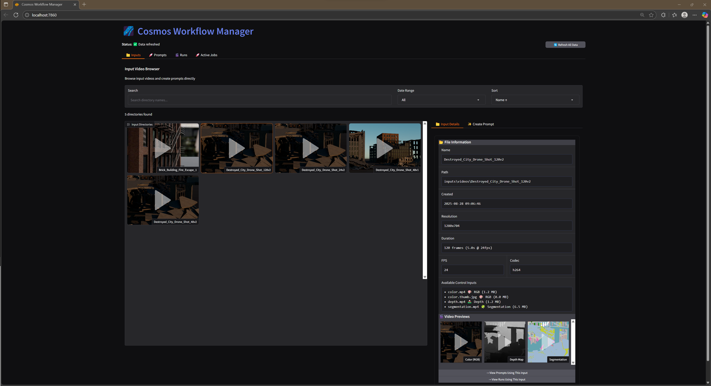

# Cosmos Workflow System

**A production Python system that orchestrates NVIDIA Cosmos AI video generation on remote GPU clusters, featuring a custom Houdini procedural city generator for synthetic training data.**

## 🎯 What This System Does

• **Generates synthetic training data** using my custom Houdini tool that creates destroyed cities with perfect multimodal outputs (depth, segmentation, etc.)
• **Orchestrates AI video generation** on remote H100 GPU clusters ($100k+ hardware) via SSH and Docker
• **Manages complex workflows** from data creation → AI processing → output retrieval with database tracking
• **Provides enterprise features** like batch processing (40% faster), real-time monitoring, and 4K upscaling
• **Abstracts infrastructure complexity** behind a clean Python API and Gradio UI

## 📋 Why This Matters

Physical AI models need diverse synthetic data for rare scenarios (destroyed buildings, disasters). My system combines procedural 3D generation with state-of-the-art AI video models to create this data at scale, managing the entire pipeline from creation to augmentation.

<div align="center">

### 🎥 AI-Generated Result: Destroyed City Scene
https://github.com/user-attachments/assets/d9670944-7518-4f0b-a58d-75ce4e901672
*Cosmos AI output using my Houdini-generated synthetic inputs (color + depth + segmentation)*

## 🖥️ Gradio Web Interface

<table>
<tr>
<td width="50%">

### Operations & Control

*Two-column layout with prompt selection and inference controls*

</td>
<td width="50%">

### Multimodal Inputs

*Weight control for depth, edge, segmentation (0.0-1.0)*

</td>
</tr>
<tr>
<td width="50%">

### AI Enhancement

*Pixtral model integration for prompt improvement*

</td>
<td width="50%">

### Real-time Monitoring

*Live log streaming with theme-aware display*

</td>
</tr>
</table>


*Gallery view showing generated videos with metadata and batch processing status*

</div>

## 🚀 Code Example

```python
from cosmos_workflow.api import CosmosAPI

# Single interface for entire system
api = CosmosAPI()

# Create prompt from Houdini-generated videos
prompt = api.create_prompt(
    "Transform this destroyed city into cyberpunk style",
    "outputs/houdini_export/scene_042/"  # Contains color.mp4, depth.mp4, segmentation.mp4
)

# Run on remote H100 GPU with multimodal control
result = api.quick_inference(
    prompt["id"],
    weights={"vis": 0.3, "edge": 0.4, "depth": 0.2, "seg": 0.1}
)
print(f"Generated: {result['output_path']}")  # outputs/run_rs_abc123/output.mp4

# Batch process multiple scenes (40% faster)
results = api.batch_inference(
    ["ps_001", "ps_002", "ps_003"],
    shared_weights={"vis": 0.25, "edge": 0.25, "depth": 0.25, "seg": 0.25}
)
```

## 🏗️ Houdini Procedural City Generator (Input Creation)

I built a production-ready Houdini tool that generates the synthetic input data for Cosmos AI:

• **Procedural city generation** - Randomized buildings with architectural details (fire escapes, facades)
• **Destruction simulation** - Automated rigid body dynamics create realistic damage patterns
• **Perfect multimodal outputs** - Pixel-perfect depth, segmentation, edge maps (no AI estimation errors)
• **Rare scenario data** - Generates training data for edge cases like disasters and destroyed infrastructure

<table>
<tr>
<td width="50%">

### Rendered Building Output
*NYC-style building with fire escape (Houdini render)*


https://github.com/user-attachments/assets/43565e9a-f675-4ec1-b454-e8318f611194

</td>
<td width="50%">

### Houdini Node Network

*Procedural generation network in Houdini*

</td>
</tr>
</table>

**Note:** These are the INPUT renders from Houdini that get processed by Cosmos AI, not the final AI output.


## 💪 Technical Achievements

### Infrastructure & Scale
• **Remote GPU orchestration** - Manages H100 GPUs ($100k+ hardware) via SSH/Docker with zero downtime
• **40-60% performance gains** - Batch inference reduces model loading overhead, processing 10 videos in 28min vs 50min sequential
• **Lazy evaluation monitoring** - Novel pattern solving CLI lifecycle issues (runs don't get stuck as "running")
• **Production reliability** - Automatic retry, graceful degradation, comprehensive error recovery

### Architecture & Code Quality
• **Database-first design** - SQLAlchemy with proper migrations, no JSON file management
• **Clean facade pattern** - Single `CosmosAPI` entry point abstracting 40+ internal modules
• **Comprehensive testing** - 600+ tests with 80%+ coverage on critical paths
• **Enterprise patterns** - Dependency injection, transaction safety, parameterized logging

### AI & Video Processing
• **Multimodal pipeline** - Handles color, depth, segmentation, edge maps with weight control (0.0-1.0)
• **Video-agnostic 4K upscaling** - Works with any video source, not just inference outputs
• **Pixtral AI enhancement** - Automatic prompt improvement using vision-language models
• **Real-time streaming** - Live log streaming from containers with theme-aware UI

## 🛠️ Tech Stack

**Core:** Python 3.10+ • SQLAlchemy 2.0 • Gradio 4.0
**Infrastructure:** Docker • SSH (Paramiko) • SFTP
**AI/ML:** NVIDIA Cosmos • Pixtral • Houdini (procedural generation)
**Testing:** Pytest • Ruff • MyPy • 80%+ coverage
**Scale:** H100 GPUs • Batch processing • Real-time streaming

## 🏗️ System Architecture

```
Local Machine                           Remote GPU Server (H100)
┌────────────────────────────┐       ┌────────────────────────────┐
│  Gradio UI / CLI / Python  │       │  Docker Container          │
│           ↓                 │       │  - Cosmos AI Model         │
│     CosmosAPI (Facade)      │  SSH  │  - GPU Execution           │
│           ↓                 │ ────> │  - Real-time Logs          │
│  DataRepository | GPUExec   │ SFTP  │                            │
│           ↓                 │ <──── │  Generated Videos          │
│    SQLite Database          │       │  (output.mp4, 4K.mp4)      │
└────────────────────────────┘       └────────────────────────────┘
```

## ✨ Core Features

### **Database-First Architecture**
- SQLAlchemy models with migration support
- Transaction safety with automatic rollback
- No persistent JSON files - pure database operations
- Extensible schema for multiple AI models

### **Remote GPU Orchestration**
- SSH-based Docker container management
- Automatic file transfer with integrity checks
- Real-time log streaming from containers
- Queue management for resource optimization

### **Batch Processing Engine**
- JSONL format for efficient batch operations
- Single model load for multiple inferences
- Streamlined batch execution with shared GPU resources
- Automatic retry and error recovery

### **Lazy Status Monitoring**
- Checks container status only when queried
- Automatic output downloading on completion
- No background threads - reliable CLI operation
- Exit code parsing from container logs

### **Advanced Web Interface (Gradio)**
- **Operations Tab**: New two-column layout with prompt selection and inference controls
- **Inference Controls**: Adjustable weights for visual, edge, depth, and segmentation controls (0.0-1.0)
- **AI Enhancement**: Prompt enhancement using Pixtral model for improved descriptions
- **Theme System**: Proper dark/light mode support respecting system preferences
- **Real-time Monitoring**: Log streaming with CSS variables instead of hardcoded colors
- **Visual Gallery**: Browse and manage generated videos with comprehensive metadata
- **Batch Management**: Progress tracking for multiple inference operations

### **AI Enhancement Pipeline**
- Prompt optimization using Pixtral model
- **Video-agnostic 4K upscaling** - upscale any video file or inference output
- **Guided upscaling** with optional prompts for AI-directed enhancement
- **Flexible upscaling sources** - from inference runs or arbitrary video files
- Safety controls and content filtering
- Metadata tracking for all operations

## 🚀 Quick Start

```bash
# Install and configure
pip install -r requirements.txt
edit cosmos_workflow/config/config.toml  # Add GPU server details

# Launch web interface
cosmos ui  # Opens at http://localhost:7860

# Or use CLI
cosmos create prompt "Cyberpunk transformation" outputs/houdini/scene_001/
cosmos inference ps_xxxxx --weights 0.3 0.4 0.2 0.1
cosmos status --stream  # Watch live execution

# Advanced features
cosmos batch-inference ps_001 ps_002 ps_003  # 40% faster
cosmos upscale --from-run rs_xxxxx --prompt "8K cinematic"
cosmos prompt-enhance ps_xxxxx  # AI prompt improvement
```

## 📚 Documentation

- **[Development Guide](docs/DEVELOPMENT.md)** - Complete setup, configuration, testing workflows
- **[API Reference](docs/API.md)** - Full command reference, Python API, database schemas
- **[Changelog](CHANGELOG.md)** - Version history and feature updates
- **[Roadmap](ROADMAP.md)** - Planned features and improvements

## 🎯 Skills Demonstrated

### System Architecture
• Designed facade pattern abstracting 40+ modules behind single API
• Implemented database-first architecture with SQLAlchemy ORM
• Created lazy evaluation pattern solving distributed system lifecycle issues

### Infrastructure & DevOps
• Orchestrated remote GPU clusters via SSH/Docker automation
• Built SFTP file transfer with integrity verification and retry logic
• Implemented real-time log streaming from remote containers

### Performance & Scale
• Achieved 40-60% speedup through batch processing optimization
• Managed concurrent operations on $100k+ GPU hardware
• Built transaction-safe database operations with automatic rollback

### Python & Software Engineering
• Comprehensive type hints and Google-style docstrings
• Context managers for resource management
• Parameterized logging for production debugging
• Clean separation of concerns across service layers

---

## 📦 Requirements

- **GPU Server**: NVIDIA H100 or similar with Docker and NVIDIA Container Toolkit
- **Cosmos Models**: Access to NVIDIA Cosmos Transfer checkpoints (Hugging Face)
- **Python 3.10+**: With SQLAlchemy, Paramiko, Gradio dependencies
- **Houdini**: For procedural city generation (optional, pre-generated data included)

See [Development Guide](docs/DEVELOPMENT.md) for detailed setup.
