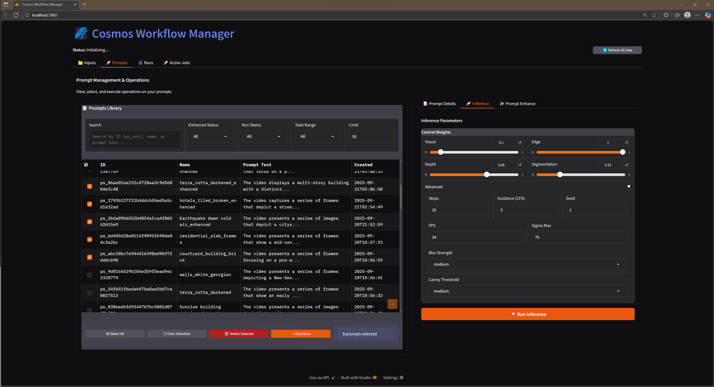

# Cosmos AI Video Pipeline

I built a production Python system that runs NVIDIA Cosmos AI models on remote H100 GPUs. It handles the full workflow: SSH orchestration, Docker execution, file transfers, database tracking, and a web UI.

**Project Stats:** 797 tests • 80%+ coverage • 21K lines • Production-ready

## 📑 Table of Contents
- [Overview](#-what-this-system-does)
- [Web Interface](#️-gradio-web-interface)
- [Technical Implementation](#-what-this-demonstrates)
- [Quick Start](#-quick-start)
- [Future Work](#-future-direction)

## 🎯 What This System Does

• **Generates synthetic training data** - Custom Houdini tool creates destroyed cities with pixel-perfect depth and segmentation maps

• **Runs Cosmos AI on remote GPUs** - Manages H100/H200 clusters via SSH and Docker for video generation

• **Handles the full pipeline** - Data creation → AI processing → output retrieval with database tracking

• **Smart batching** - Groups similar jobs to reuse GPU model loads, reducing overhead by ~30-40%

• **Clean Python API** - Single facade abstracts infrastructure complexity behind simple method calls

## 📋 Why Physical AI Needs This

Physical AI models (robotics, autonomous vehicles) need training data for rare scenarios: disasters, structural damage, hazardous environments. Real-world data is expensive and dangerous to capture.

My system solves this by:
1. **Generating perfect synthetic data** - Houdini procedural generation creates destroyed cities with pixel-perfect depth/segmentation
2. **Augmenting with AI** - Cosmos AI transforms base scenes into diverse variations
3. **Managing at scale** - Handles the full workflow from generation → augmentation → tracking

This lets companies generate thousands of rare-scenario training examples without real-world capture.

<div align="center">

### 🎥 AI-Generated Result: Destroyed City Scene


https://github.com/user-attachments/assets/ca96da3a-ef7a-4625-beda-ebeae7dcfb94


*From my Houdini procedural generator → Cosmos AI augmentation. This shows the full pipeline from synthetic data generation to AI-powered video transformation.*

</div>

## 🖥️ Gradio Web Interface

<table>
<tr>
<td width="50%">

### Prompt Details & Management

*Comprehensive prompt library with filtering, search, and batch operations*

</td>
<td width="50%">

### Multimodal Inference Controls

*Input video browser with automatic control file detection (depth, edge, segmentation)*

</td>
</tr>
<tr>
<td width="50%">

### Inference Parameters

*Adjustable weights for visual, edge, depth, and segmentation controls (0.0-1.0)*

</td>
<td width="50%">

### Results Gallery

*Gallery view with filtering, search, and comprehensive run details*

</td>
</tr>
</table>


*Real-time job queue monitoring with GPU status, log streaming, and smart batching optimization*

</div>

## What This Demonstrates

**System Architecture**
- Facade pattern API that abstracts 40+ modules behind a single interface
- Database-first design with SQLAlchemy ORM (no JSON file management)
- 797 automated tests with 80%+ coverage on critical paths

**Infrastructure & Scale**
- SSH/Docker automation on remote H100 clusters via Paramiko
- Built cross-platform SFTP file transfer with integrity checks (replaced rsync for Windows)
- Smart batching reduces overhead ~30-40% by grouping jobs and reusing GPU model loads

**Performance Engineering**
- Reduced Gradio UI from 3,255 to 152 lines (95% reduction) through modular refactoring
- Database transactions with `SELECT FOR UPDATE SKIP LOCKED` for atomic job claiming
- Real-time log streaming from remote containers without blocking execution

**Production Patterns**
- Type hints and Google-style docstrings throughout
- Context managers for resource safety (SSH connections, database sessions)
- Parameterized logging for production debugging (no f-strings in logs)

## 🚀 Code Example

```python
from cosmos_workflow.api import CosmosAPI

api = CosmosAPI()

# Create prompt from video directory
prompt = api.create_prompt(
    "Cyberpunk cityscape transformation",
    "inputs/my_video_dir/"  # Contains: color.mp4, depth.mp4, segmentation.mp4
)

# Run on remote H100 GPU (blocks until complete)
result = api.quick_inference(
    prompt["id"],
    weights={"vis": 0.3, "edge": 0.4, "depth": 0.2, "seg": 0.1}
)

print(f"Output: {result['output_path']}")  # outputs/run_rs_abc123/output.mp4
```

## 🏗️ Houdini Procedural City Generator (Input Creation)

I built a production-ready Houdini tool that generates synthetic input data for Cosmos AI:

• **Procedural city generation** - Randomized buildings with architectural details (fire escapes, facades)

• **Destruction simulation** - Automated rigid body dynamics create realistic damage patterns

• **Perfect multimodal outputs** - Pixel-perfect depth, segmentation, edge maps (no AI estimation errors)

• **Rare scenario focus** - Training data for edge cases like disasters and destroyed infrastructure

**Scale:** Can generate hundreds of unique destroyed city variations from a single parameter sweep

<table>
<tr>
<td width="50%">

### Rendered Building Output

https://github.com/user-attachments/assets/43565e9a-f675-4ec1-b454-e8318f611194

*NYC-style building with fire escape (Houdini render)*

</td>
<td width="50%">

### Houdini Node Network


*Procedural generation network in Houdini*

</td>
</tr>
</table>

**Note:** These are the INPUT renders from Houdini that get processed by Cosmos AI, not the final AI output.


## 💪 Technical Achievements

### Performance & Scale
• **Smart batching reduces overhead ~30-40%** - Groups similar jobs to reuse GPU model loads instead of reinitializing

• **Remote GPU management** - Handles H100/H200 clusters via SSH/Docker with automatic container cleanup

• **Production reliability** - 797 tests with 80%+ coverage, automatic retry, graceful degradation

### Architecture & Code Quality
• **Database-first design** - SQLAlchemy ORM with atomic transactions, no JSON file management

• **Clean API design** - Single facade abstracts 40+ modules behind simple interface

• **Modular UI** - Reduced main Gradio file from 3,255 → 152 lines (95% reduction)

### AI & Video Processing
• **Multimodal pipeline** - Handles color, depth, segmentation, edge with configurable weights (0.0-1.0)

• **4K upscaling** - Works with any video source, not just inference outputs

• **AI prompt enhancement** - Pixtral vision-language model integration for automatic improvement

• **Real-time log streaming** - Live container logs without blocking execution

## 🛠️ Tech Stack

**Core:** Python 3.10+ • SQLAlchemy 2.0 • Gradio 4.0
**Infrastructure:** Docker • SSH (Paramiko) • SFTP
**AI/ML:** NVIDIA Cosmos • KEYbert • Houdini (procedural generation)
**Testing:** Pytest • Ruff • MyPy • 80%+ coverage
**Scale:** H100 GPUs • Batch processing • Real-time streaming

## 🏗️ System Architecture

```
Local Machine                                    Remote GPU Server (H100)
┌─────────────────────────────────────────┐     ┌────────────────────────────┐
│       Gradio UI / CLI / Python API      │     │   Docker Container         │
│                  ↓                      │     │   ┌──────────────────┐     │
│  ┌═══════════════════════════════════┐  │     │   │ Cosmos AI Model  │     │
│  ║       CosmosAPI (Facade)          ║  │     │   │ GPU Execution    │     │
│  ║                                   ║  │ SSH │   │ Real-time Logs   │     │
│  ╚═══════════════════════════════════╝  │ ───>│   └──────────────────┘     │
│           ↓              ↓              │     │                            │
│  ┌──────────────┐    ┌───────────────┐  │ SFTP│   Generated Videos:        │
│  │DataRepository│    │ GPUExecutor   │  │ <───│   • output.mp4             │
│  │(Database Ops)│    │(Orchestration)│  │     │   • upscaled_4K.mp4        │
│  └──────────────┘    └───────────────┘  │     │                            │
│           ↓              ↓              │     └────────────────────────────┘
│  ┌───────────────────────────────────┐  │
│  │     SQLAlchemy + SQLite DB        │  │
│  │     (Prompts, Runs, Metadata)     │  │
│  └───────────────────────────────────┘  │
└─────────────────────────────────────────┘
```

## ✨ Core Features

### **Production Job Queue System**
- Database-backed queue with SQLite persistence (survives UI restarts)
- Atomic job claiming using `SELECT FOR UPDATE SKIP LOCKED` (no race conditions)
- Single warm container strategy prevents resource accumulation
- FIFO processing with position tracking and estimated wait times
- Automatic cleanup: deletes successful jobs, keeps last 50 failed for debugging
- Timer-based processing (2-second intervals) without background threads

### **Smart Batching (~30-40% speedup)**
- Groups similar jobs to reuse GPU model loads
- Run-level optimization extracts individual runs and reorganizes into efficient batches
- Two modes: Strict (identical controls) and Mixed (master batch approach)
- Safe batch sizing based on control count prevents GPU out-of-memory errors

### **Database-First Architecture**
- SQLAlchemy ORM with transaction safety and automatic rollback
- No JSON files - pure database operations
- 797 tests with 80%+ coverage on critical paths
- Extensible schema supports multiple AI models

### **Remote GPU Management**
- SSH/Docker automation on H100/H200 clusters via Paramiko
- Cross-platform SFTP file transfer with integrity checks (replaced rsync for Windows)
- Real-time log streaming without blocking execution
- Automatic container cleanup prevents resource leaks

### **Web Interface (Gradio)**
- Cross-tab navigation with intelligent filtering
- Real-time container monitoring with live log streaming
- Video gallery with rating system (1-5 stars)
- Batch operations (select, delete multiple runs/prompts)
- Modular architecture: reduced main file from 3,255 → 152 lines (95%)

### **AI Enhancement Pipeline**
- Prompt optimization using Pixtral vision-language model
- 4K upscaling works with any video (not just inference outputs)
- Optional guided upscaling with custom prompts
- Automatic download of control files (depth, normal, canny)

## 🚀 Quick Start

```bash
# Install and configure
pip install -r requirements.txt
edit cosmos_workflow/config/config.toml  # Add GPU server details

# Launch web interface
cosmos ui  # Opens at http://localhost:7860

# Or use CLI
cosmos create prompt "Cyberpunk transformation" outputs/houdini/scene_001/
cosmos inference ps_xxxxx --weights 0.3 0.4 0.2 0.1  # Blocks until complete
cosmos status --stream  # Watch live execution logs

# Advanced features
cosmos batch-inference ps_001 ps_002 ps_003  # ~30-40% faster
cosmos upscale --from-run rs_xxxxx --prompt "8K cinematic"
cosmos prompt-enhance ps_xxxxx  # AI prompt improvement
```

## 📚 Documentation

- **[UI Guide](UI_GUIDE.md)** - Comprehensive guide to the Gradio web interface with tab-by-tab walkthrough
- **[Development Guide](docs/DEVELOPMENT.md)** - Complete setup, configuration, testing workflows
- **[API Reference](docs/API.md)** - Full command reference, Python API, database schemas
- **[Changelog](CHANGELOG.md)** - Version history and feature updates
- **[Roadmap](ROADMAP.md)** - Planned features and improvements

## 🎯 Skills Demonstrated

### System Architecture
• Designed facade pattern that abstracts 40+ modules behind single API

• Database-first architecture with SQLAlchemy ORM and atomic transactions

• Solved distributed system lifecycle issues through lazy evaluation patterns

### Infrastructure & DevOps
• Remote GPU cluster management via SSH/Docker automation

• Built cross-platform SFTP file transfer with integrity verification and retry logic

• Real-time log streaming from remote containers

### Performance & Scale
• Smart batching achieves ~30-40% speedup through GPU model reuse

• Managed concurrent operations on H100 GPUs

• Transaction-safe database operations with automatic rollback

### Python & Software Engineering
• Type hints and Google-style docstrings throughout

• Context managers for resource safety

• Parameterized logging for production debugging

• Clean separation of concerns across service layers

---

## 📦 Requirements

- **GPU Server**: NVIDIA H100 or similar with Docker and NVIDIA Container Toolkit
- **Cosmos Models**: Access to NVIDIA Cosmos Transfer checkpoints (Hugging Face)
- **Python 3.10+**: With SQLAlchemy, Paramiko, Gradio dependencies
- **Houdini**: For procedural city generation (optional, pre-generated data included)

See [Development Guide](docs/DEVELOPMENT.md) for detailed setup.

---

## 🚀 Future Direction

Exploring integration with **NVIDIA Cosmos Reason** (7B vision-language model) to automatically validate augmented outputs for physical accuracy. This would create a quality-assurance loop ensuring only physically plausible training data enters the pipeline.

Also investigating **LeRobot** integration for sim-to-real robot training using augmented synthetic data.
